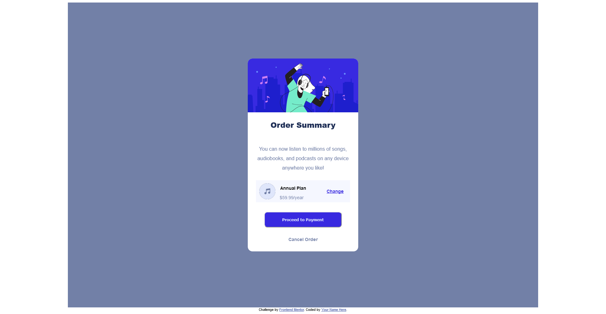

# Frontend Mentor - Order summary card solution

This is a solution to the [Order summary card challenge on Frontend Mentor](https://www.frontendmentor.io/challenges/order-summary-component-QlPmajDUj). Frontend Mentor challenges help you improve your coding skills by building realistic projects.

## Table of contents

- [Overview](#overview)
  - [The challenge](#the-challenge)
  - [Screenshot](#screenshot)
  - [Links](#links)
- [My process](#my-process)
  - [Built with](#built-with)
  - [What I learned](#what-i-learned)
- [Author](#author)

## Overview

This is my fourth project from Frontend Mentor. It is an order summary component.

### Screenshot

### Links

- Solution URL: [Link to the source files](https://github.com/electricman07/order-summary-component)
- Live Site URL: [link to the live site](https://your-live-site-url.com)

## My process

to complete the project I used HTML and CSS. I used flexbox to center and position the elements.

### Built with

- Semantic HTML5 markup
- CSS custom properties
- Flexbox

### What I learned

I learned more about centering with CSS flexbox and positioning the elements so they look like the image.

## Author

- Website - [Glen Popowich](https://github.com/electricman07)
- Frontend Mentor - [@electricman07](https://www.frontendmentor.io/profile/electricman07)
- Twitter - [@glen_popowich](https://www.twitter.com/glen_popowich)
